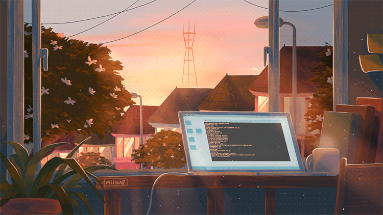

<h1>Hi 👋, I'm Pedro Faria</h1>

- 🔥 Frontend developer focused on building clean and user-friendly interfaces
- 🔭 Currently learning advanced CSS, React and state management
- 💬 Ask me about **HTML, CSS, JavaScript, React** and **UX/UI design**
- 🤝 **Open to freelance work and new projects** — feel free to reach out!
- ⚡ In my spare time I enjoy reading, gaming, and exploring new tech trends

 

## 🚀 &nbsp;Portfolio

  

An interactive, scroll-driven career journey built with React — walk through my career chapter by chapter.

 

## 🛠 &nbsp;Tech Stack

&nbsp;
&nbsp;
&nbsp;
&nbsp;
&nbsp;
&nbsp;
&nbsp;
&nbsp;
&nbsp;
&nbsp;
&nbsp;

 

## 📌 &nbsp;Featured Projects

  
  
  

- **PedroFaria-CV** — interactive, scroll-driven résumé/portfolio built with React
- **crimson-painting-store** — D&D miniatures e-commerce prototype (React + Vite, Tailwind, EUR/English)
- **Everything-Box** — a small tool with local AI that assists with everyday work tasks (TypeScript)

 

## ⚙️ &nbsp;GitHub Analytics

  
  

  

### 📊 Extended Metrics ([lowlighter/metrics](https://github.com/lowlighter/metrics))

<!-- Rendered instantly via the free shared instance — no GitHub Action needed. -->

  

Want more plugins (isometric calendar, languages breakdown, etc.)? Run it yourself via the GitHub Action in `metrics.yml` — see notes below.

 

## 🏆 &nbsp;Trophies

  

 

## 🔗 &nbsp;Social Links

  
  
  

  

